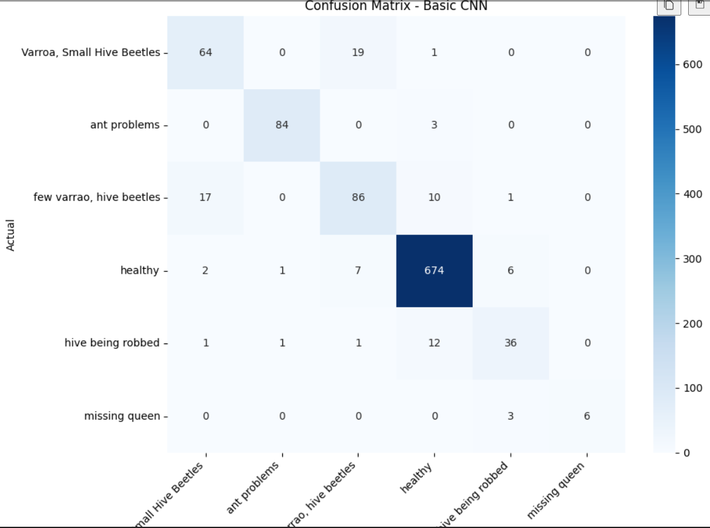
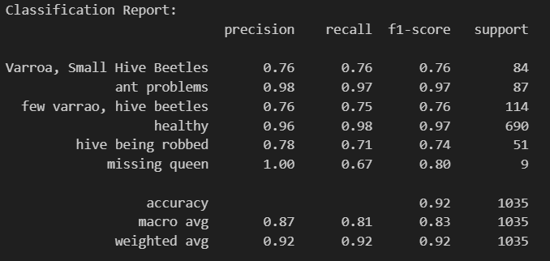
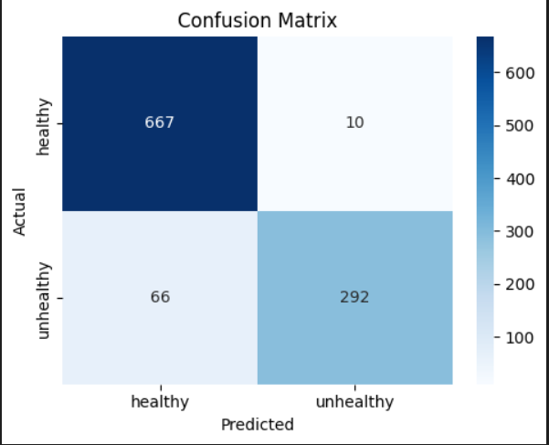
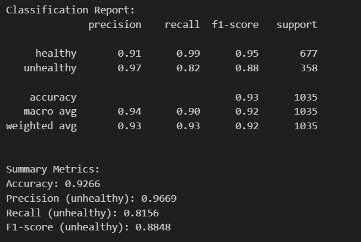
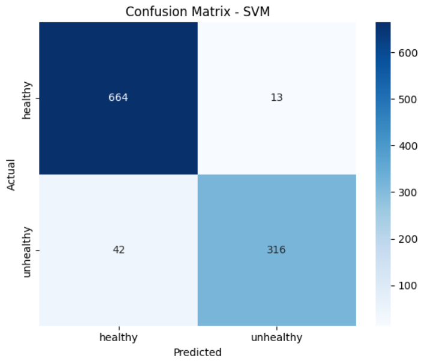
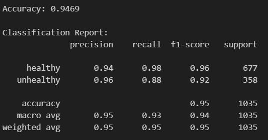
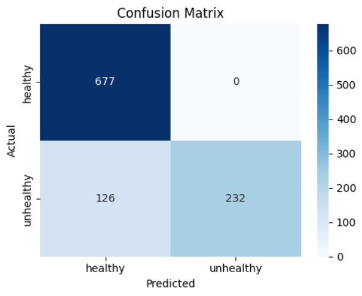
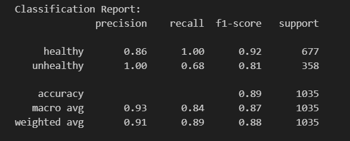

## Dataset download (Kaggle)

This repository does not include the full image dataset in Git.

To download and stage the dataset locally:

1. Install dependencies and kagglehub:
   pip install -r requirements.txt
   pip install kagglehub
2. Set up Kaggle API credentials (one-time):
   - Create API token from your Kaggle account settings.
   - Put kaggle.json in %USERPROFILE%/.kaggle/kaggle.json
   - Or set KAGGLE_USERNAME and KAGGLE_KEY as environment variables.
3. Run the downloader directly:
   python download_dataset.py

You can also run split directly. It now checks/downloads the dataset before splitting:

python split.py --input data/raw/bee_data.csv --output data/processed/processed_bee_data.csv

Optional flags:
- --skip_dataset_download
- --force_dataset_download

First activate venv
Then download requirements.txt
Select interpreter?

The project is organized by data, models, notebooks, and results.
Each model is implemented in a separate Python file to keep the comparison clear.

What could increase  model performance is more images, thats why as i said in the proposal, we need more data
how can I be sure to trust the author of the data
my images are color, meaning 3D tensors will be used, color layer (height, width and color) will be separated into 3 dimensions: result in height-width-red, height-width-green, height-width-blue
Images range between great differences: 137 x 121 to things like 46x 60 pixels - result in smaller images upsampled with larger images downsampled with using 128x128
keras is used: keras is a high-level library built on top of tensorflow, simple and intuitive

For future work, it would also be possible to use Transfer Learning, in order to leverage pre-trained transformers, for example for images.

pip install -r requirements.txt

For readme, since I didn't upload the dataset to github, use Jenny Yang's BeeImage dataset from Kaggle
https://www.kaggle.com/datasets/jenny18/honey-bee-annotated-images
is automatic download solvable with a script? Google Drive or Kaggle

https://www.youtube.com/watch?v=33ysE1Gt1G4&list=PLCC34OHNcOtpcgR9LEYSdi9r7XIbpkpK1&index=14

I could further proof it by using own images?

I could use a library that explains what the model considers important parts of the image

Explain in theis what the limitations are
Limitations of public datasets

Gap between academic and real-world ML

Ethical considerations

Future work for deployment

Start out with most basic CNN

Next up: 
- more cnn models
    - before that, fix classes (multiple, healthy, unhealthy)
- random forest, svm for images

For understanding I stopped at Cell 2

Deepak Meeting 02.02:
TODO
- Implement all three algorithms
- Present an initial comparison of the results
# More random for split in cnn
# Strategy to overcome overfitting
# Model loss
# Important: undestand output

Achieved:
- neater workspace organization
-- data, models, notebooks, and results
-- separate file for each model, so results are clean
- random forest
- further understanding

# As early disease detection and prevention is really important, thats why models are already good-enough if they can differentiate between 2 classes. Future work could be even better performance for all 6 health classes, due to data imbalance and model suit.

https://www.datacamp.com/tutorial/convolutional-neural-networks-python
https://www.datacamp.com/tutorial/pytorch-cnn-tutorial
https://www.datacamp.com/tutorial/random-forests-classifier-python
https://www.kaggle.com/code/prashant111/random-forest-classifier-tutorial

TODO:
- clean cnn of exploration and data cleaning
- svm
- halve the healthy or make unhealthy bigger -> balance the classes
- after conclusion, try to come up with a concrete result and a reason, why one model performs better or worse, focus on main conclusion, RQ
read and think of strengths, weaknesses in literature, see if it applies; see what methods papers use, see if they also utilized the same with different parameters.
Feb 12th Feb 15:00

Achieved as of last time:
- SVM implementation with PCA
- CNN + SVM hybrid with PCA
- read literature, made notes
- revised machine learning knowledge for strengths and weaknesses of methods

Plans: 
- read more literature, get specific comparison
- balance the dataset in all cases (oversample/undersample), because so far i only used stratify, which doesnt help with imbalance 
- CNN to binary classifier, test again
- bring more concrete evidence, in numbers etc.
- tune models, and hyperparameters, see how it performs

| Approach | What It Is | Pros ( forImage Classification) | Cons (for Image Classification) | Notes  |
|---|---|---|---|---|
| Convolutional Neural Network (CNN) | deep learning model that learns features + classifier | Learns spatial features automatically; strong accuracy; scales to large datasets; is well-suited to multiple class predictions | Data‑hungry; need GPU/compute power; more complex to tune (knowledge of Neural Network training); less interpretable | Best when you have many labeled images |
| Random Forest | Ensemble (Bagging) of decision trees on engineered features | Fast to train; robust to noise; interpretable via feature importance (which is difficult to interpret with images) | Needs handcrafted features; struggles with raw pixels; limited for high‑dimensional image data; binary classification | Solid baseline model |
| SVM | Margin‑based classifier ( with kernels) | Effective on small/medium datasets; strong with good features; good generalization | Needs feature engineering; poor with large datasets; kernel choice sensitive; high computational power required or PCA with high-dimensional data | Good when data is limited and features are strong |
| Hybrid (CNN features + SVM) | CNN extracts features, SVM classifies | Works well with limited data; leverages CNN feature power; simpler classifier | Two‑stage pipeline; feature extraction cost; tuning both parts | Often strong when labels are scarce but compute is available |

# Confusion Matrix and Performance!
## CNN

- Accuracy: 0.92
- Precision: macro avg - 0.87, weighted avg - 0.92
- Recall: 0.81, 0.92
- F1-score: 0.83, 0.92

## Random Forest

- Accuracy: 0.93
- Precision: 0.95
- Recall: 0.90
- F1-score: 0.92

## SVM

- Accuracy: 0.95
- Precision: 0.95
- Recall: 0.93
- F1-score: 0.94

## CNN + SVM Hybrid

- Accuracy: 0.88
- Precision: 0.92
- Recall: 0.82
- F1-score: 0.85

Ranking (based on F1-score):
1. SVM
2. Random Forest
3. Convolutional Neural Network (with all features)
4. Hybrid

But new order might be more applicable, because we want to eliminate False Positives (predicted as healthy, when in reality unhealthy), so maybe Precision should be focused

"You're on a really good track"
We stop the implementation here
Next up: March 2nd: New meeting
To-do:
- Read more papers
- read my own proposal
- put 4.1 in Background
- 4.4 in chapter 1
- New chapter 5 - Evaluation/Results: How I did and what I got, go into detail here and include many relevant works
- Plan and Approach is in Chapter 1, Background is in Chapter 2
Evaluation:
- In conclusion: importance of work - how it helps, what this brings to researchers, farmers - conclusion or discussion
- Approach: bee data source, ml pipeline, describe bit of code, show images, but not so much, describe practical work but not so much
- Include new material and references, sources, papers: cnn works who did what and what i did, how it relates to mine; find papers not necessarily about bees, also we re doing it for algorithms and machine learning, others did this with cnn and I did this
- Aim for Journals, best
- Second best: Conference papers
- How many people referenced a paper, google scholar shows, the more people the better
- Informatics books are old-fashioned

Next up - 02.03:
Write into the evaluation and results chapter, include materials
Re-read in some places the proposal
conclusion: importance of work - how it helps, what this brings to researchers, farmers - conclusion or discussion

Prompt "Does python keras CNN have built in FNN and CNN? Like how do the final results come? We need a FNN right to have a bet on the outcome"
How CNN Keras handles CNN and FNN
Input Image
   ↓
Convolution Layers (feature extraction)
   ↓
Pooling Layers (reduce size)
   ↓
Flatten (convert 2D → 1D vector)
   ↓
Dense Layers (this is your FNN part)
   ↓
Output Layer (prediction)

R vs Python can be mentioned